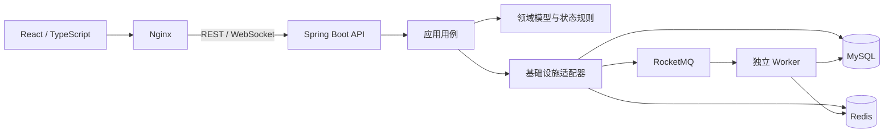

# PeerGrab

校园跑腿交易平台：发布悬赏、资金托管、并发抢单、履约结算、退款与仲裁。


## 核心流程

| 发布与托管 | 抢单与履约 | 结算与争议 |
| --- | --- | --- |
| 发单人发布任务，悬赏同步托管 | 多人竞争一个名额；跑腿确认、取货、送达，超时可递补 | 发单人确认结算；取消则退款，争议交由仲裁员处理 |

## 功能实拍

|  |  |
| --- | --- |
| [](docs/assets/screenshots/square.png) 任务广场 | [](docs/assets/screenshots/publish.png) 发布与托管 |
| [](docs/assets/screenshots/detail.png) 履约进度 | [](docs/assets/screenshots/wallet.png) 钱包流水 |
| [](docs/assets/screenshots/credit.png) 信用分 | [](docs/assets/screenshots/notifications.png) 实时通知 |
| [](docs/assets/screenshots/arbitration.png) 争议仲裁 |  |

## 架构



后端是八模块 Maven 工程。当前使用单个 MySQL；任务详情的操作按钮由后端 `availableActions` 决定。

- **抢单**：资格检查、Sentinel 限流、Redis Lua、MySQL CAS 与唯一索引守住单名额。
- **资金**：发布托管，结算、退款、仲裁按业务号幂等入账，并通过对账校验。
- **流转**：RocketMQ 定时消息处理超时与自动结算，Worker 扫描兜底，WebSocket 推送进度。

## 技术栈

| 部分 | 技术 |
| --- | --- |
| 前端 | React 18 · TypeScript · Vite 5 · WebSocket |
| 后端 | Java 21 · Spring Boot 3.5.8 · Maven |
| 数据与消息 | MySQL 8 · Redis 7 · RocketMQ 5 |

## 快速开始

需要 Docker 与 Compose v2：

```bash
cd peergrab-backend/docker
cp -n .env.example .env
docker compose -f docker-compose.yaml -f docker-compose.full.yaml --env-file .env up -d --build
```

打开 `http://127.0.0.1:25173`。演示身份：发单人 `1001 / demo1001`、跑腿 `2001 / demo2001` 或 `2002 / demo2002`、仲裁员 `9001 / demo9001`。开发与测试命令见[后端](peergrab-backend/README.md)和[前端](peergrab-frontend/README.md)文档；已有旧版 Docker 数据请先看[迁移说明](peergrab-backend/docker/UPGRADE.md)。
