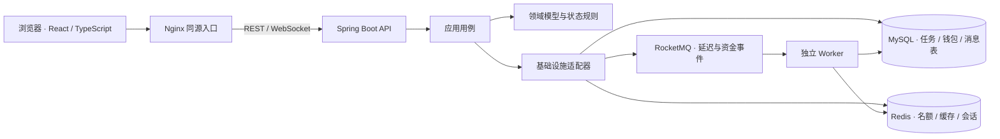

# PeerGrab

校园互助任务平台：从发布悬赏、资金托管，到抢单履约、结算退款和争议仲裁，把一笔跑腿任务走完。

PeerGrab 面向校内发单人、跑腿者和仲裁员。它把「多人争一个名额」与「每一分钱有据可查」放在同一条业务链路里：前端呈现任务和操作，后端统一裁决状态，MySQL 保存最终事实，Redis 与 RocketMQ 承担并发控制和异步流转。


## 一笔任务如何完成

```text
发单人发布任务 ──► 悬赏进入托管 ──► 跑腿者抢单 ──► 发单人确认
                                             │                 │
                                             │ 超时未确认       ▼
                                             └──► 候选递补 / 重新开放
                                                       取货 ──► 送达 ──► 结算
                                                                          │
                                           取消 ──► 退款       争议 ──► 仲裁分配
```

任务广场、发布、我的任务、详情、钱包、信用分和消息构成七个页面。详情页直接使用 API 返回的 `availableActions` 渲染当前身份可执行的动作，避免浏览器再维护一份状态机。演示身份包括发单人、两名跑腿者和仲裁员。

## 功能实拍

以下截图来自本地隔离演示环境中的真实浏览器操作，展示的是示例数据。

| 浏览与发布 | 任务履约 |
| --- | --- |
| [](docs/assets/screenshots/square.png) 任务广场：浏览和筛选可抢任务 | [](docs/assets/screenshots/publish.png) 发布任务：填写悬赏并同步托管 |
| [](docs/assets/screenshots/detail.png) 任务详情：按身份和状态展示可执行操作 | [](docs/assets/screenshots/wallet.png) 钱包：余额与逐笔资金流水 |
| [](docs/assets/screenshots/credit.png) 信用分：查看分数、事件和排名 | [](docs/assets/screenshots/notifications.png) 消息：状态与资金事件通知 |
| [](docs/assets/screenshots/arbitration.png) 仲裁：处理争议并分配托管资金 |  |

## 架构与关键设计



后端为八模块 Maven 工程，采用领域、应用、基础设施和接口分层。API 与 Worker 分进程部署，复用同一套用例和适配器；当前运行环境使用**单个 MySQL**。ShardingSphere 的规则与算法是已验证的设计实验，尚未接入运行时数据源。

- **抢单正确性**：资格检查、Redis Lua 原子扣名额、MySQL CAS 和唯一索引共同限制单名额任务只产生一个成功者。数据库是最终裁决者。
- **资金闭环**：发布时托管；结算、退款、仲裁走事务与幂等业务号；借贷平衡、账户快照和托管闭环由三层对账校验。
- **异步流转**：确认超时和自动结算使用本地消息表、RocketMQ 定时消息及 Worker 兜底扫描；重复投递由轮次、版本和消息键约束。
- **读写体验**：任务详情缓存采用 Cache Aside 与校验任务；WebSocket 推送状态变化，持久消息列表用于断线后补读。发布请求可传 `X-Request-Id` 避免重试后重复扣款。

## 技术栈

| 部分 | 实现 |
| --- | --- |
| 前端 | React 18、TypeScript、Vite 5、WebSocket、Nginx |
| 后端 | Java 21、Spring Boot 3.5.8、Maven、JdbcTemplate、ArchUnit |
| 数据与消息 | MySQL 8、Redis 7、RocketMQ 5、Redisson |
| 并发与实验 | Redis Lua、数据库 CAS、Sentinel 热点限流、ShardingSphere 规则实验 |
| 部署 | Docker Compose：前端、API、Worker 与三个中间件 |

## 本地运行

需要 Docker 和 Compose v2。全栈演示默认只绑定本机回环地址，入口为 `http://127.0.0.1:25173`。首次启动：

```bash
cd peergrab-backend/docker
cp -n .env.example .env
docker compose -f docker-compose.yaml -f docker-compose.full.yaml --env-file .env config --quiet
docker compose -f docker-compose.yaml -f docker-compose.full.yaml --env-file .env up -d --build
docker compose -f docker-compose.yaml -f docker-compose.full.yaml --env-file .env ps
```

演示登录：发单人 `1001 / demo1001`、跑腿者 `2001 / demo2001` 和 `2002 / demo2002`、仲裁员 `9001 / demo9001`。这些是公开的本地演示凭据；普通应用配置默认不启用演示登录。停止时在同一目录执行 `docker compose -f docker-compose.yaml -f docker-compose.full.yaml --env-file .env down`，保留数据卷时不要加 `-v`。已有旧栈先阅读[迁移说明](peergrab-backend/docker/UPGRADE.md)，再启动新命名栈。

本机开发需要 JDK 21、Maven 3.9+ 和 Node 20+；API、Worker、前端的独立启动方式见[后端 README](peergrab-backend/README.md)和[前端 README](peergrab-frontend/README.md)。业务 API 保持 `/api/errands`、`/api/wallet`、`/api/credit` 和 `/api/notifications` 等路径。

## 验证与历史证据

```bash
cd peergrab-backend && mvn test
cd ../peergrab-frontend && npm ci && npm run build
```

集成测试会清理流水、托管单并重置测试账户，必须显式启用且连接**可丢弃的独立 MySQL/Redis**；细节见[后端 README](peergrab-backend/README.md)。在可丢弃演示库上，可从 `peergrab-backend` 运行 `python3 bench/scripts/smoke_e2e.py --env-file docker/.env` 检查发布、抢单、结算、退款、仲裁与通知；该脚本会改变演示账户余额。

[历史压测报告](peergrab-backend/bench/reports/report-P6-P7-20260822-complete.md)记录了 **2026-08-22** 旧版同机环境下，任务广场固定 GET 在 400 并发档约 6455 QPS、P99 151ms。发压端、应用与中间件同机，负载与当前版本不同；这个数字是当时实验记录，**不是当前容量承诺**。[2026-09-25 隔离栈冒烟](peergrab-backend/bench/reports/smoke-20260925-current.md)只验证工具和链路，采样极短，同样不用于容量判断。后续实验口径见[性能压测与架构决策方案](peergrab-backend/docs/性能压测与架构决策方案.md)。

## 已知边界与文档

- 公开任务接口目前限制 `slotTotal=1`，多人抢单指多人竞争一个名额；用户体系只有四个本地演示身份。
- 单库本地事务是当前资金正确性的基础；分片仅有规则和路由测试，没有在线迁移或多库资金事务。
- 自然到期的端到端流转 P99、完整故障注入与现行版本安全容量仍需在独立环境实测。
- ES/Canal 已从运行架构移除，任务检索走 MySQL；旧设计文档中的 ES/Canal 内容仅保留为方案比较和演进记录。

可继续阅读[架构设计](peergrab-backend/docs/架构设计与技术选型.md)、[当前架构评估](peergrab-backend/docs/项目架构与技术选型评估.md)、[设计演进](peergrab-backend/docs/设计演进记录.md)和[压测方案](peergrab-backend/docs/压测方案与容量评估.md)。

## 来源说明

PeerGrab 是 LittleSongxx 经授权迁入并维护的校园跑腿工程版本，原项目标识为 CampusDash。本仓库从当前工作区建立新的根提交；原有提交历史另行私有归档，没有把旧提交重新署名。历史实验报告保留原始日期、场景与限制，以便追溯其证据口径。
