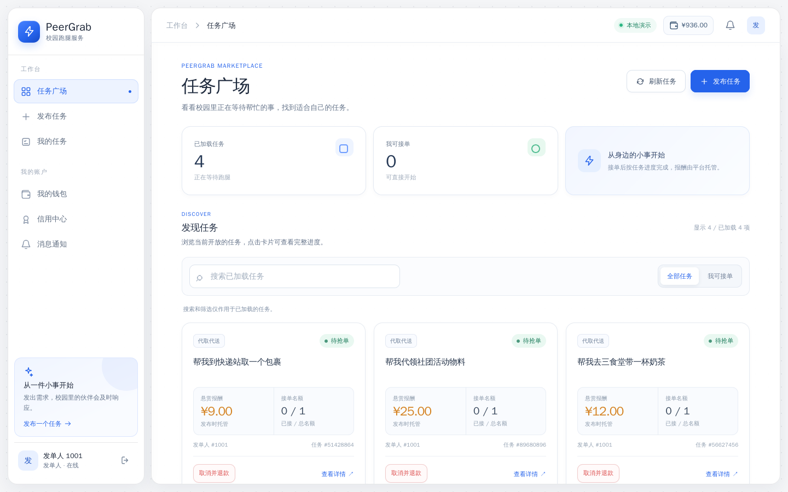
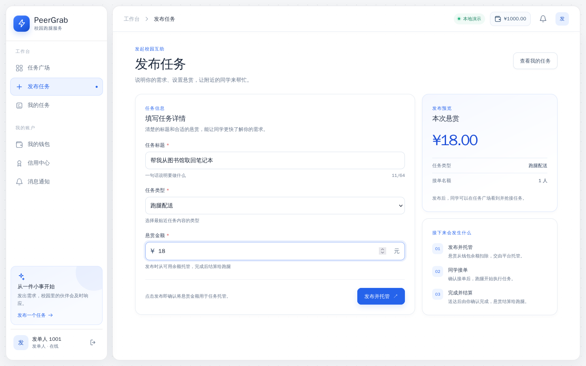
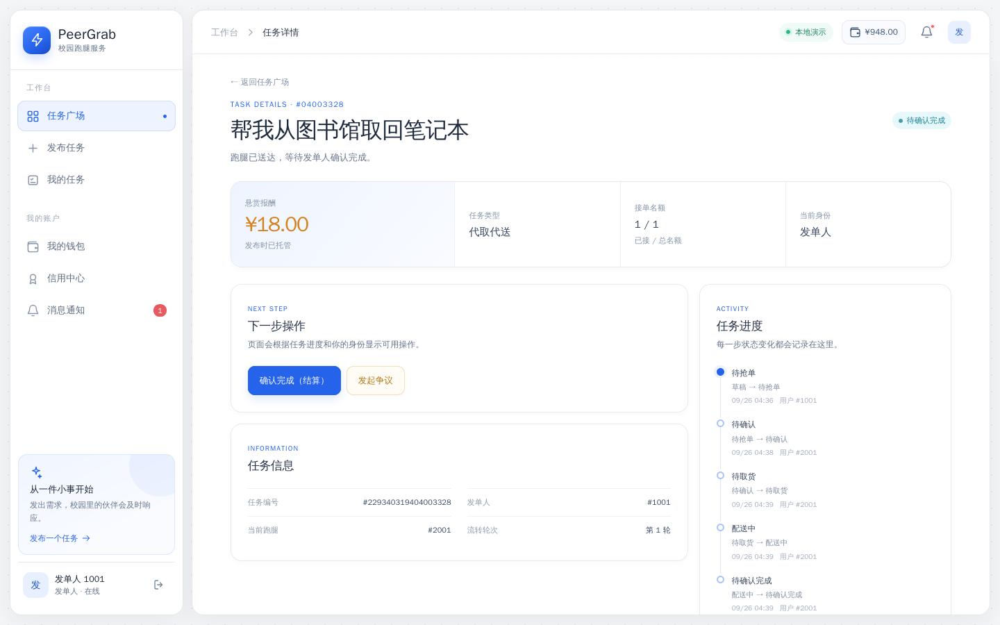
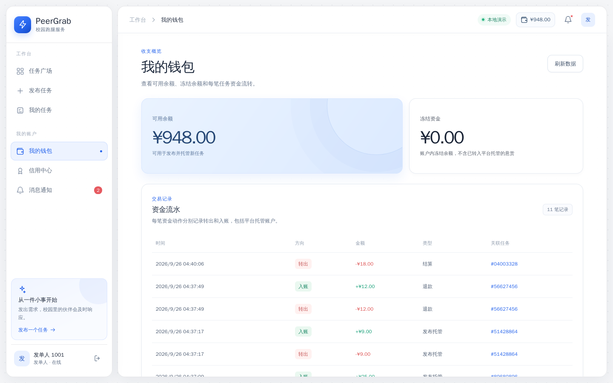
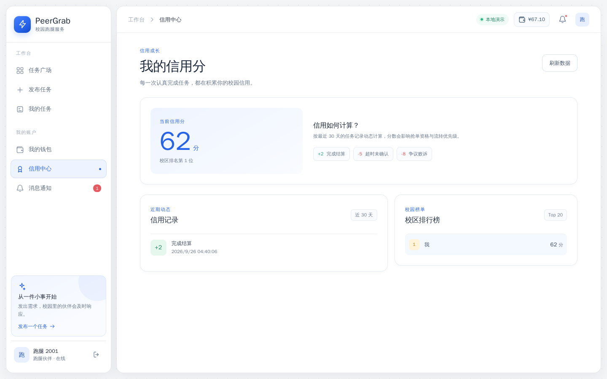
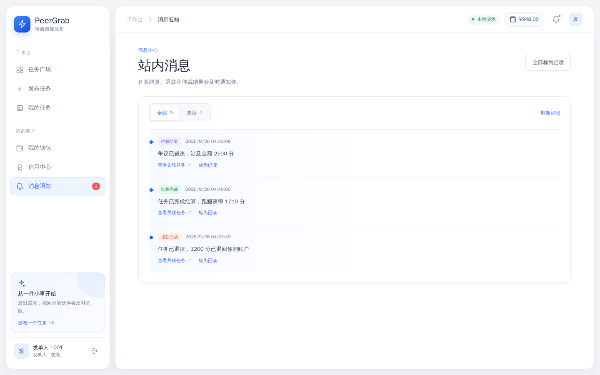
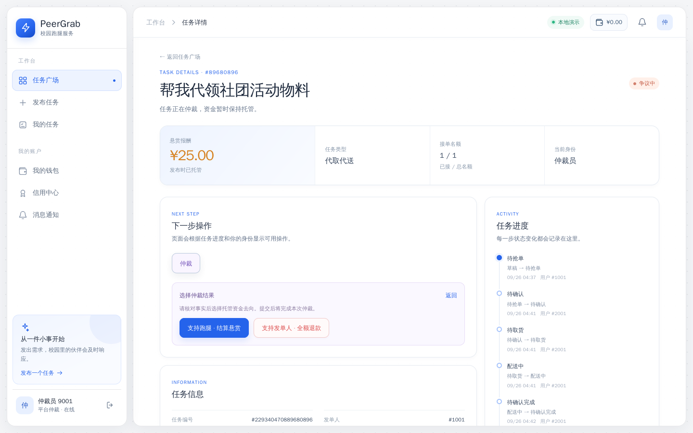
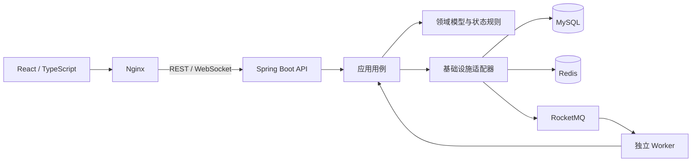

# PeerGrab

校园跑腿交易平台：发布悬赏、资金托管、并发抢单、履约结算、退款与仲裁。

[在线体验：www.peergrab.cn](https://www.peergrab.cn)



## 核心流程

| 发布与托管 | 抢单与履约 | 结算与争议 |
| --- | --- | --- |
| 发单人发布任务，悬赏同步托管 | 多人竞争一个名额；跑腿确认、取货、送达，超时可递补 | 发单人确认结算；取消则退款，争议交由仲裁员处理 |

## 功能实拍

|  |  |
| --- | --- |
| [](docs/assets/screenshots/square.png) 任务广场 | [](docs/assets/screenshots/publish.png) 发布与托管 |
| [](docs/assets/screenshots/detail.png) 履约进度 | [](docs/assets/screenshots/wallet.png) 钱包流水 |
| [](docs/assets/screenshots/credit.png) 信用分 | [](docs/assets/screenshots/notifications.png) 实时通知 |
| [](docs/assets/screenshots/arbitration.png) 争议仲裁 |  |

## 架构



API 与 Worker 复用应用用例；领域层定义状态规则和端口，基础设施层实现 MySQL、Redis、MQ 适配。ArchUnit 在测试中检查依赖边界。当前资金链路基于单 MySQL 本地事务。

- **发布即托管**：任务、托管单、账户扣款和复式分录在同一事务提交；金额以整数分保存，`X-Request-Id` 防止发布重试重复扣款。
- **并发抢单**：热点限流与信用资格检查先挡无效请求，Redis Lua 原子预占名额，MySQL 状态与版本 CAS 加唯一索引最终裁决；Redis 不可用时仍可由数据库裁决。
- **状态机驱动交互**：领域层约束任务流转，后端按状态和当前身份计算 `availableActions`；前端据此显示按钮，不另写一套状态规则。
- **资金防重与对账**：结算以任务状态 CAS、托管单状态 CAS、流水业务号唯一约束防重复入账；账户按固定顺序更新，后台核对借贷平衡、余额快照和托管闭环。
- **可靠异步**：超时递补和自动结算同事务登记本地消息，再交给 RocketMQ 定时投递；发送失败重试、Worker 扫描兜底，版本与轮次拦住过期消息。资金事件另用事务消息和流水回查。
- **缓存与通知**：详情采用 Cache Aside、逻辑过期和互斥回填，布隆判否仍核实 MySQL；缓存不参与抢单裁决。WebSocket 推送变化，断线由持久消息与轮询补齐。

## 技术栈

| 部分 | 技术 |
| --- | --- |
| 前端 | React 18 · TypeScript · Vite 5 · WebSocket |
| 后端 | Java 21 · Spring Boot 3.5.8 · Maven |
| 数据与消息 | MySQL 8 · Redis 7 · RocketMQ 5 |

## 快速开始

需要 Docker 与 Compose v2：

```bash
cd peergrab-backend/docker
cp -n .env.example .env
docker compose -f docker-compose.yaml -f docker-compose.full.yaml --env-file .env up -d --build
```

打开 `http://127.0.0.1:25173`。演示身份：发单人 `1001 / demo1001`、跑腿 `2001 / demo2001` 或 `2002 / demo2002`、仲裁员 `9001 / demo9001`。开发与测试命令见[后端](peergrab-backend/README.md)和[前端](peergrab-frontend/README.md)文档；已有旧版 Docker 数据请先看[迁移说明](peergrab-backend/docker/UPGRADE.md)。
